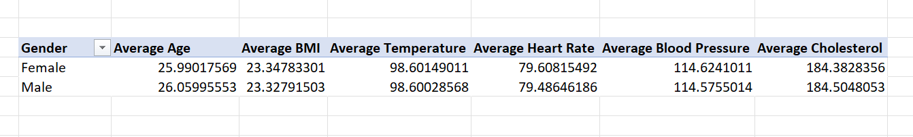
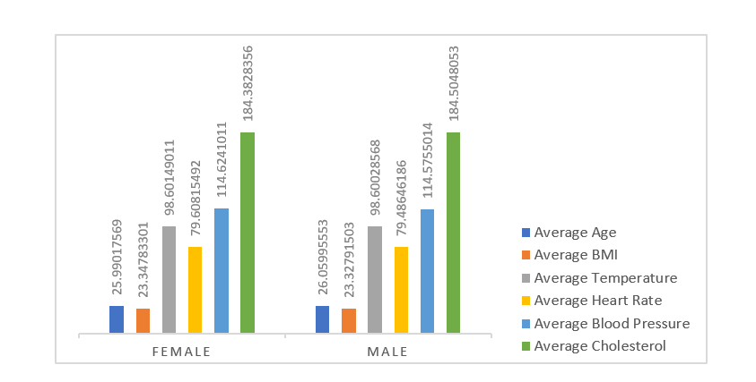
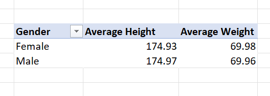
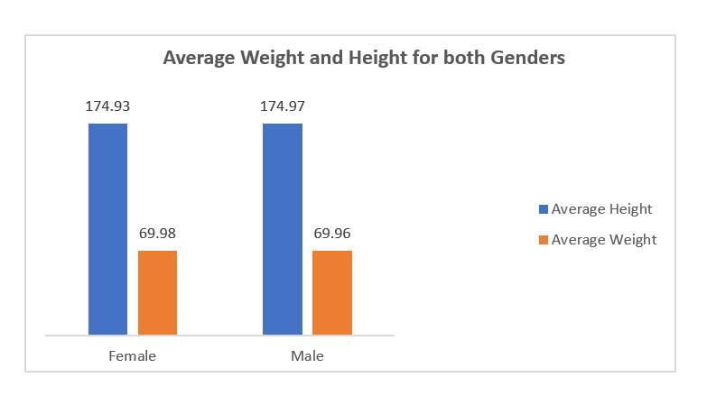
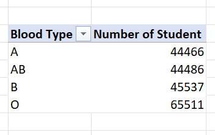
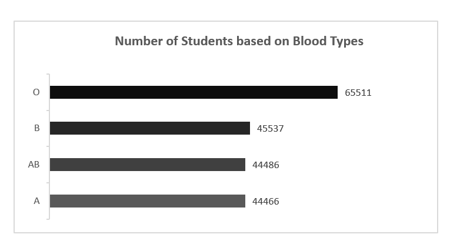
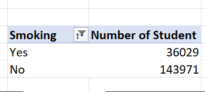
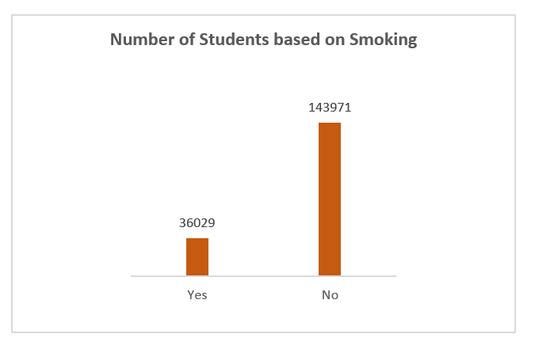
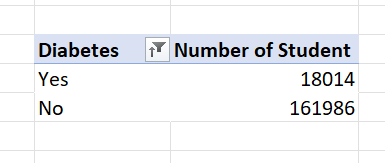

# Medical Students Data Analysis

## Introduction 

This is an excel project of a set of medical students. The aim of this project is to analyze their health data in order to gain insight into their health status and health decision making. **_Disclaimer_**: This data does not represent any institution. 

## Problem Statement 

This analysis aims to analyze and visualize the dataset to provide answers to the following questions: 
- What is the average values for the following for Male and Females (Age, BMI, Temperature, Heart Rate, Blood Pressure, and Cholesterol)?
- What is the average height and Weight for both Genders (in 2 decimal places)?
- What is the number of students across the different Blood Groups?
- What is the number of students who smoke and those who don’t?
- What is the number of students who have diabetes and those who don’t?

## Data Sourcing 

This dataset was provided to me by my tutor so as to use it and carry out tasks. 

- Skills demonstrated
- Data cleaning
- Data sorting
- Data transformation
- Basic Excel functions
- Pivot tables
- Data visualization

## Data Transformation 

The data was transformed by formatting each data in all columns to fit the required data type and duplicates were also checked and none was found. Also, the blank cells were filled up using the appropriate information. 

## Analysis/Visualization

#### What is the average values for the following for Male and Females (Age, BMI, Temperature, Heart Rate, Blood Pressure, and Cholesterol)?

The average values for age, BMI, heart rate, blood pressure and cholesterol for both genders were analyzed using a pivot table and then visualized using a column chart. The pivot table and visualization chart are below. 

Average Values                 |   Visualization  Chart
:---------------------------  | :----------------------
 | 

#### What is the average height and Weight for both Genders (in 2 decimal places)?

The average height and weight of both genders were analyzed using the pivot table and visualized using a bar chart. The result is highlighted in the images below. 

Average Height and Weight      |   Visualization Chart
:----------------------------- | :---------------------
  | 

#### What is the number of students across the different Blood Groups?

This was analyzed using the pivot table and visualized using a chart. The results are highlighted in the below images. 

Number of Students                         |  Visualization Chart
:----------------------------------------  | :--------------------------------
                   | 

#### What is the number of students who smoke and those who don’t?

The number of students who smoke and those who don’t smoke was found out using a pivot table and visualized using a column chart. The result of this analysis is highlighted in the below images.

Number of Students                |  Visualization Chart 
:-------------------------------  | :---------------------------
            | 

#### What is the number of students who have diabetes and those who don’t?

This was analyzed using the pivot table and visualized using a bar chart. The result is highlighted below. 

Number of Students            | Visualization Chart 
:---------------------------- | :------------------------
       |  

## Conclusion 

Going by the result of the analysis, it was found out that the students have moderate BMI, heart rate and temperature. Also, it was also found out that there are high number of students who don’t smoke and have diabetes. This could be because that they are medical students and this status could help them make better decisions regarding their health and well-being. 
